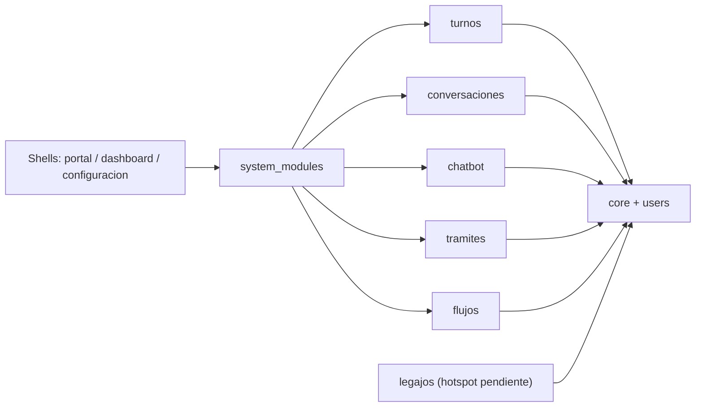
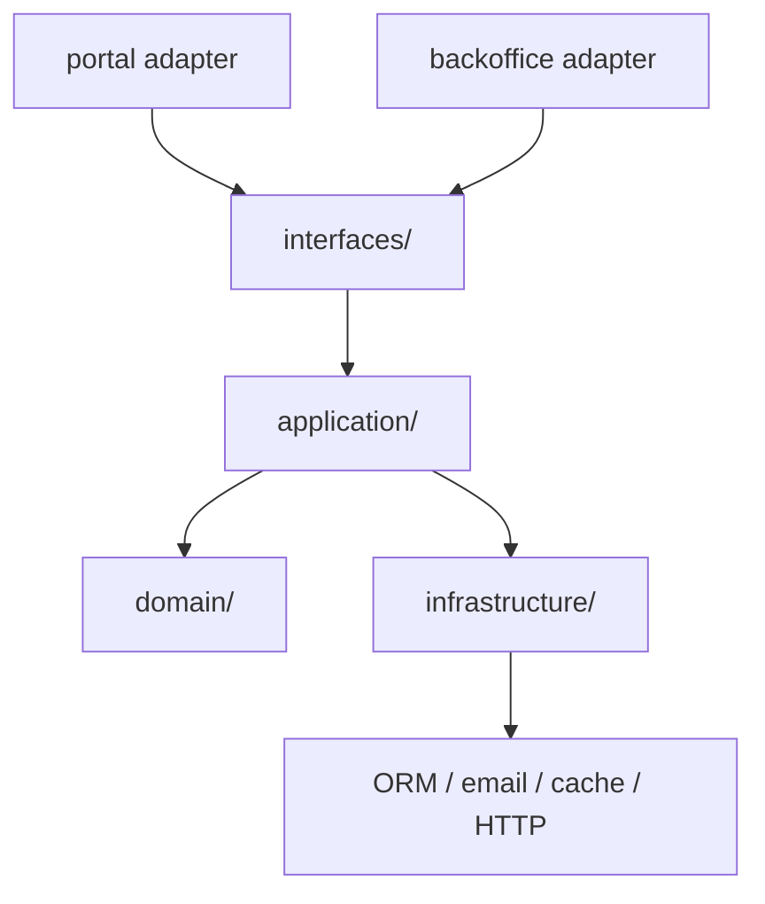

# SistemSo - Monolito modular activable

SistemSo evoluciona sobre un monolito modular pragmatico. La prioridad no es "volver todo hexagonal", sino bajar acoplamiento real, poder apagar modulos opcionales sin romper shells compartidos y dejar una estructura que se pueda clonar por cliente sin un big bang de datos ni de rutas.

## Principios

- `system_modules/` es el control plane del monolito.
- `portal`, `dashboard` y `configuracion` son shells/adapters. No son duenos del dominio.
- Cada modulo vertical expone contratos publicos y oculta su infraestructura detras de adapters.
- `core` y `users` funcionan como shared kernel minimo.
- La logica de dominio solo se desacopla de Django donde agrega valor real. El piloto completo es `turnos`.

## Mapa general



## Estructura interna de un modulo con hexagono pragmatico



## Estados de modulo

- No instalado: no aparece en `config/modules.py::INSTALLED_PROJECT_MODULES`, no publica rutas, y un deep link puede dar `404`.
- Instalado e inactivo: existe en el catalogo, pero `ModuleState.is_enabled=False`. La UI debe degradar con mensaje y las APIs deben responder `module_inactive`.
- Instalado y activo: publica rutas, capacidades y grupos gestionados.

## Modulos registrados hoy

| Modulo | Rol actual | Estado arquitectonico |
| --- | --- | --- |
| `turnos` | Piloto vertical de dominio | `domain/ + application/ + infrastructure/ + interfaces/` |
| `chatbot` | Modulo opcional | Catalogo + guards + shell awareness |
| `conversaciones` | Modulo opcional | Catalogo + guards + shell awareness |
| `tramites` | Modulo opcional | Catalogo + guards + shell awareness |
| `flujos` | Modulo opcional | Catalogo + guards + shell awareness |

## Documentacion clave

- `docs/funcionalidades/arquitectura-modular/v1.0_monolito-modular-activable.md`
- `docs/team/guia-modulos.md`
- `docs/team/reglas-arquitectura-modular.md`
- `docs/team/plan-migracion-modular.md`
- `docs/team/checklist-validacion-modular.md`
- `docs/team/preguntas-control-modular.md`
- `system_modules/README.md`
- `turnos/README.md`

## Operacion minima

```powershell
py -3 manage.py modules sync
py -3 manage.py modules list
py -3 manage.py test system_modules --settings=config.settings_test
```

## Regla de crecimiento

Para agregar un modulo nuevo:

1. Crear `mi_modulo/module.py` con un `ModuleDefinition` explicito.
2. Agregar el slug en `config/modules.py::INSTALLED_PROJECT_MODULES`.
3. Agregar guards y degradacion en los shells que consumen ese modulo.
4. Exponer contratos publicos claros y tests minimos.
5. Solo abrir `domain/application/infrastructure/interfaces` si el dominio lo justifica.
