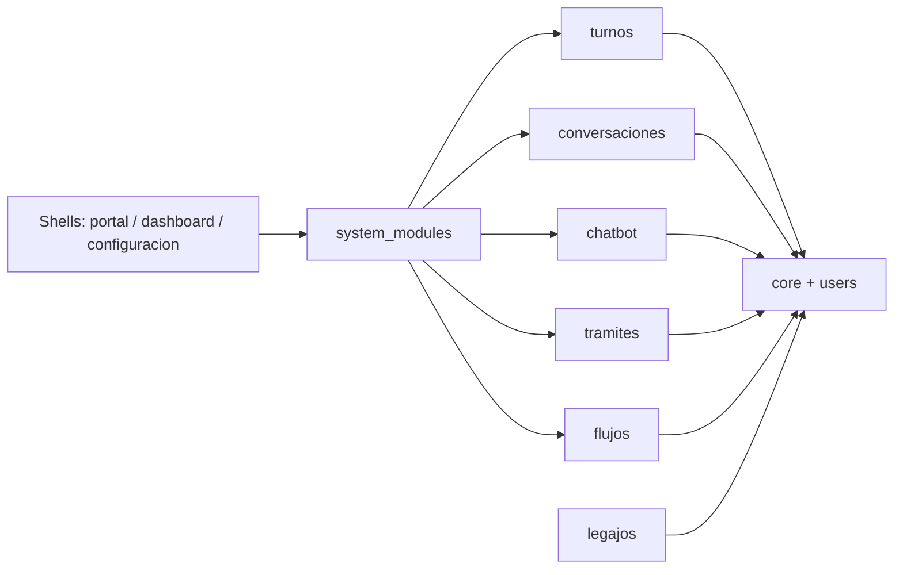
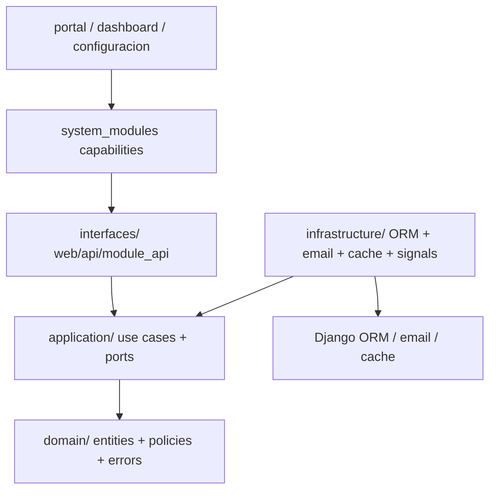

# SistemSo - Monolito modular activable y hexagonal

SistemSo evoluciona sobre un monolito modular activable con layout hexagonal literal por modulo. La prioridad es bajar acoplamiento real, poder apagar o quitar modulos opcionales desde un unico control plane y dejar una estructura replicable por cliente sin un big bang de datos ni de migrations.

## Principios

- `system_modules/` es el control plane del monolito.
- `portal`, `dashboard` y `configuracion` son shells/adapters con layout hexagonal fisico. No son duenos del dominio.
- Cada modulo vertical expone contratos publicos desde `interfaces/module_api.py` y oculta su infraestructura detras de adapters.
- `core` y `users` funcionan como shared kernel minimo.
- Todo modulo declarado debe tener `domain/`, `application/`, `infrastructure/` e `interfaces/`, aunque alguna capa sea fina.
- Los modelos Django historicos pueden seguir top-level por estabilidad de labels, migrations y contenttypes, pero son infraestructura ORM y no contrato publico entre modulos.
- No quedan entrypoints publicos top-level para `views`, `forms`, `services`, `selectors`, `signals`, `api_views`, `serializers`, `templates`, `static`, `consumers` ni `routing`. Esas superficies viven fisicamente en `interfaces/`, `application/` o `infrastructure/`.

## Mapa general



## Estructura interna de un modulo



## Estados de modulo

- No instalado: no aparece en `config/modules.py::INSTALLED_PROJECT_MODULES`, no publica rutas, y un deep link puede dar `404`.
- Instalado e inactivo: existe en el catalogo, pero `ModuleState.is_enabled=False`. La UI debe degradar con mensaje y las APIs deben responder `module_inactive`.
- Instalado y activo: publica rutas, capacidades y grupos gestionados.

## Modulos registrados hoy

| Modulo | Rol actual | Estado arquitectonico |
| --- | --- | --- |
| `core` | Shared kernel minimo | Layout hexagonal literal, rutas canonicales en `interfaces/` |
| `users` | Auth/usuarios | Layout hexagonal literal, rutas canonicales en `interfaces/` |
| `system_modules` | Control plane | Layout hexagonal literal, comando `modules` y registry |
| `healthcheck` | Core tecnico | Layout hexagonal literal |
| `portal` | Shell ciudadano | Layout hexagonal literal; consume capacidades |
| `dashboard` | Shell backoffice | Layout hexagonal literal; consume capacidades |
| `configuracion` | Shell/config base | Layout hexagonal literal; consume capacidades |
| `turnos` | Modulo no removible por deuda de FKs | Dominio y aplicacion desacoplados de Django |
| `legajos` | Hotspot no removible por deuda de FKs | Adapters fisicos en `interfaces/` e `infrastructure/`; subdominios encapsulados dentro de la app historica |
| `chatbot` | Modulo opcional removible | Rutas canonicales y guards |
| `conversaciones` | Modulo opcional removible | Rutas canonicales, API y WebSocket por `interfaces/` |
| `tramites` | Modulo opcional removible | Rutas canonicales y guards |
| `flujos` | Modulo opcional removible | Rutas web/API canonicales y guards |

## Documentacion clave

- `docs/funcionalidades/arquitectura-modular/v1.0_monolito-modular-activable.md`
- `docs/team/guia-modulos.md`
- `docs/team/reglas-arquitectura-modular.md`
- `docs/team/plan-migracion-modular.md`
- `docs/team/checklist-validacion-modular.md`
- `docs/team/preguntas-control-modular.md`
- `system_modules/README.md`
- `turnos/README.md`

## Operacion minima

```powershell
py -3 manage.py modules sync
py -3 manage.py modules list
py -3 manage.py test system_modules --settings=config.settings_test
```

## Smokes funcionales

```powershell
$env:DJANGO_SECRET_KEY='test-secret-key'
$env:PYTEST_RUNNING='1'
py -3 manage.py test system_modules.tests.test_architecture system_modules.tests.test_functional_smokes --settings=config.settings_test
```

## Regla de crecimiento

Para agregar un modulo nuevo:

1. Crear `mi_modulo/module.py` con un `ModuleDefinition` explicito.
2. Agregar el slug en `config/modules.py::INSTALLED_PROJECT_MODULES`.
3. Agregar guards y degradacion en los shells que consumen ese modulo.
4. Exponer contratos publicos claros y tests minimos.
5. Crear siempre `domain/`, `application/`, `infrastructure/` e `interfaces/`.
6. Exponer rutas desde `interfaces/web/urls.py` y `interfaces/api/urls.py`; no desde `urls.py` top-level.
7. No crear `views.py`, `forms.py`, `services.py`, `selectors.py`, `signals.py`, `api_views.py`, `serializers.py`, `templates/`, `static/`, `consumers.py` ni `routing.py` en la raiz del modulo.
