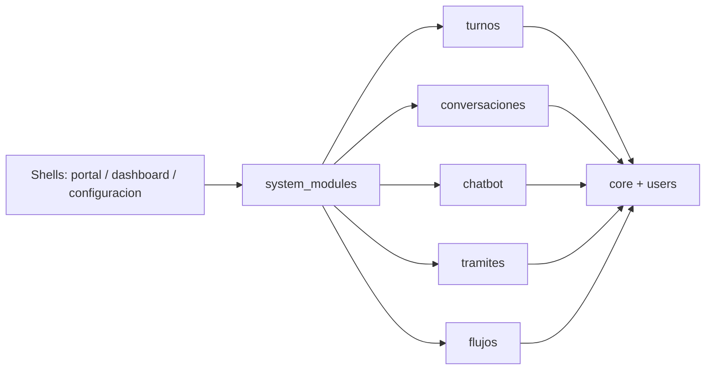
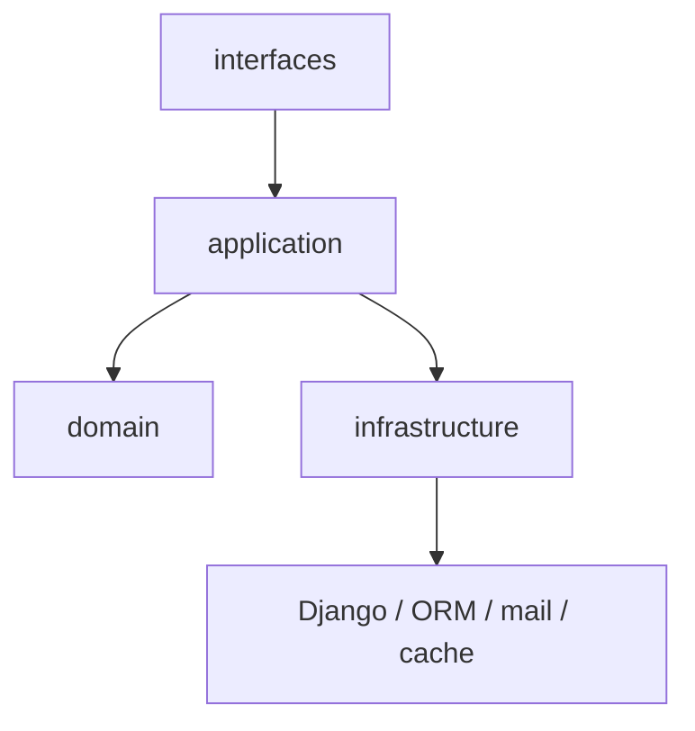

# Arquitectura modular - v1.0

> Version: v1.0
> Fecha: 2026-04-23
> Tipo: EVOLUTIVO
> App/Modulo: `system_modules`, `turnos`, `portal`, `dashboard`, `configuracion`

---

## Descripcion

Se introduce un monolito modular activable con catalogo explicito de modulos, activacion por instancia y shells resilientes. El foco es desacoplar lo suficiente para apagar modulos opcionales sin romper el sistema, y validar un piloto hexagonal real en `turnos` sin forzar el mismo nivel de abstraccion en todo el repo.

## User Story

```
Como equipo de desarrollo quiero un monolito modular activable para poder clonar el repo por cliente, prender o apagar modulos de forma segura y seguir evolucionando el sistema sin acoplamiento transversal innecesario.
```

## Criterios de aceptacion

- [x] Existe un catalogo explicito de modulos instalados.
- [x] Un modulo instalado pero inactivo responde con degradacion controlada en HTML y JSON.
- [x] Los shells no publican accesos a modulos inactivos.
- [x] `turnos` queda con layout `domain/application/infrastructure/interfaces`.
- [x] La documentacion deja claro como agregar modulos nuevos y como no romper la arquitectura.

## Diagramas

### Vision general



### Dependencias permitidas dentro de un modulo



## Archivos involucrados

| Archivo | Rol | Cambios en esta version |
| --- | --- | --- |
| `system_modules/*` | Control plane | Catalogo, estado, guards, admin, sync y tests |
| `config/settings.py` | Configuracion | Registro explicito de modulos y context processor |
| `config/urls.py` | Routing | Publicacion condicional de rutas opcionales |
| `turnos/domain/*` | Dominio | Politicas de disponibilidad y workflow |
| `turnos/application/*` | Casos de uso | Reserva, aprobacion, rechazo, cancelacion y completado |
| `turnos/infrastructure/*` | Infraestructura | Repositorios ORM y notificaciones |
| `turnos/interfaces/*` | Contrato publico | API consumida por portal y backoffice |
| `portal/templates/...` | Shell ciudadano | Degradacion segura de accesos opcionales |
| `templates/includes/base.html` | Shell global | Capacidades, JS global y bubble condicionados |

## Migraciones generadas

- `system_modules/migrations/0001_initial.py` - tabla `ModuleState`
- `system_modules/migrations/0002_modulestate_is_installed.py` - distincion entre modulo instalado y removido

## Dependencias

- Depende de: `core`, `users`, templates base del backoffice y portal.
- Usada por: shells (`portal`, `dashboard`, `configuracion`) y modulos opcionales registrados.

## Decisiones tecnicas

- El catalogo es explicito. No hay autodiscovery.
- `turnos` es el unico piloto hexagonal completo de esta etapa.
- Los modulos opcionales restantes arrancan con catalogo + guards + shell awareness.
- `legajos` no se parte todavia para evitar una migracion de alto riesgo sobre datos y rutas.

## Trade-offs

- Conviven adapters legacy y estructura nueva durante la migracion.
- No todo el repo queda al mismo nivel de "pureza" arquitectonica en esta fase.
- El control plane agrega una tabla y un comando nuevos, pero evita acoplamiento invisible y magia fragil.

## Validacion

- Tests unitarios de `system_modules`.
- Tests de arquitectura en `turnos`.
- Tests de shells en portal y backoffice.
- Validacion puntual de guards para `chatbot`, `conversaciones`, `tramites`, `flujos` y `turnos`.

## Limitaciones conocidas / deuda tecnica

- `legajos` sigue siendo el hotspot principal y se parte en fases futuras.
- `dashboard` y `configuracion` quedan como shells-aware; no se redisenan como dominios.
- Falta validacion Docker-first porque el engine local no estaba disponible en esta estacion.
