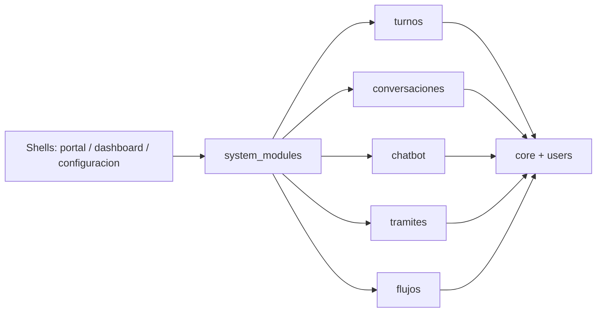
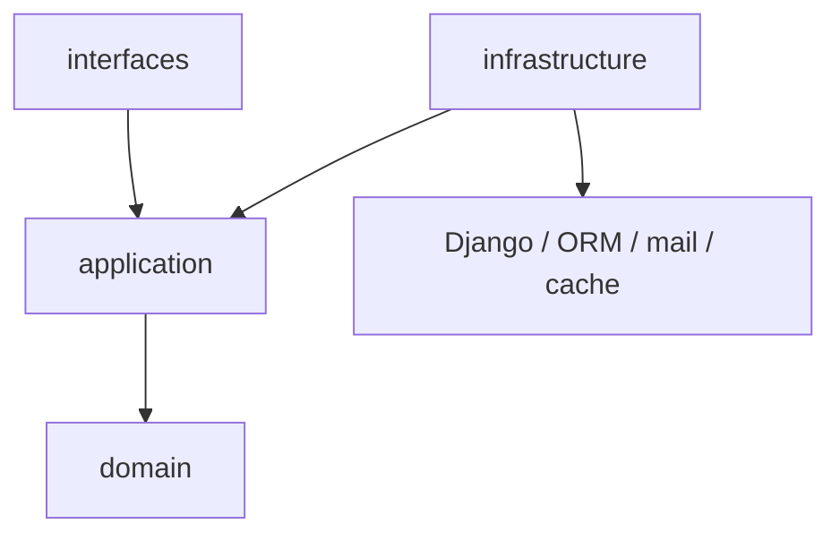

# Arquitectura modular - v1.0

> Version: v1.0
> Fecha: 2026-04-23
> Tipo: EVOLUTIVO
> App/Modulo: `system_modules`, `turnos`, `portal`, `dashboard`, `configuracion`

---

## Descripcion

Se introduce un monolito modular activable con catalogo explicito de modulos, activacion por instancia, shells resilientes y layout hexagonal literal por modulo. El foco es desacoplar lo suficiente para apagar o quitar modulos opcionales sin romper el sistema y fijar una forma canonica replicable.

## User Story

```
Como equipo de desarrollo quiero un monolito modular activable para poder clonar el repo por cliente, prender o apagar modulos de forma segura y seguir evolucionando el sistema sin acoplamiento transversal innecesario.
```

## Criterios de aceptacion

- [x] Existe un catalogo explicito de modulos instalados.
- [x] Un modulo instalado pero inactivo responde con degradacion controlada en HTML y JSON.
- [x] Los shells no publican accesos a modulos inactivos.
- [x] Todos los modulos declarados tienen layout `domain/application/infrastructure/interfaces`.
- [x] Las rutas propias de modulos se publican desde `interfaces/web/urls.py` o `interfaces/api/urls.py`.
- [x] La documentacion deja claro como agregar modulos nuevos y como no romper la arquitectura.

## Diagramas

### Vision general



### Dependencias permitidas dentro de un modulo



## Archivos involucrados

| Archivo | Rol | Cambios en esta version |
| --- | --- | --- |
| `system_modules/*` | Control plane | Catalogo, estado, guards, admin, sync y tests |
| `config/settings.py` | Configuracion | Registro explicito de modulos y context processor |
| `config/urls.py` | Routing | Publicacion condicional de rutas opcionales |
| `turnos/domain/*` | Dominio | Politicas de disponibilidad y workflow |
| `turnos/application/*` | Casos de uso | Reserva, aprobacion, rechazo, cancelacion y completado |
| `turnos/infrastructure/*` | Infraestructura | Repositorios ORM y notificaciones |
| `turnos/interfaces/*` | Contrato publico | API consumida por portal y backoffice |
| `*/interfaces/web/urls.py` | Adapter web | URLConf canonica por modulo |
| `*/interfaces/api/urls.py` | Adapter API | URLConf canonica por modulo cuando aplique |
| `portal/templates/...` | Shell ciudadano | Degradacion segura de accesos opcionales |
| `templates/includes/base.html` | Shell global | Capacidades, JS global y bubble condicionados |

## Migraciones generadas

- `system_modules/migrations/0001_initial.py` - tabla `ModuleState`
- `system_modules/migrations/0002_modulestate_is_installed.py` - distincion entre modulo instalado y removido
- `system_modules/migrations/0003_module_metadata.py` - metadata de tipo, core y removibilidad

## Dependencias

- Depende de: `core`, `users`, templates base del backoffice y portal.
- Usada por: shells (`portal`, `dashboard`, `configuracion`) y modulos opcionales registrados.

## Decisiones tecnicas

- El catalogo es explicito. No hay autodiscovery.
- Todos los modulos declarados adoptan layout hexagonal literal, aunque shells y core tecnico tengan capas finas.
- Los modulos opcionales publican rutas desde adapters canonicos y siguen usando guards del control plane.
- `legajos` conserva modelos/tablas historicas por riesgo de datos, pero el contrato publico vive en `interfaces/`.

## Trade-offs

- Se conserva el label Django top-level de las apps para no tocar tablas, migrations ni contenttypes en esta fase.
- `legajos` y `turnos` quedan clasificados como no removibles por dependencias historicas de esquema.
- El layout fisico agrega carpetas finas en modulos chicos, pero simplifica las reglas de arquitectura y los tests.
- El control plane agrega una tabla y un comando nuevos, pero evita acoplamiento invisible y magia fragil.

## Validacion

- Tests unitarios de `system_modules`.
- Tests de arquitectura para todos los modulos declarados.
- Tests de shells en portal y backoffice.
- Validacion puntual de guards para `chatbot`, `conversaciones`, `tramites`, `flujos` y `turnos`.

## Limitaciones conocidas / deuda tecnica

- `legajos` sigue siendo el hotspot principal y se parte por subdominio sin mover tablas historicas en bloque.
- `dashboard`, `portal` y `configuracion` quedan como shells con layout fisico hexagonal, sin inventar dominio de negocio propio.
- La validacion local corre con `config.settings_test`; la validacion Docker se ejecuta con Compose cuando el engine esta disponible.
