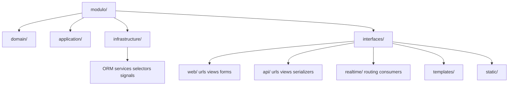
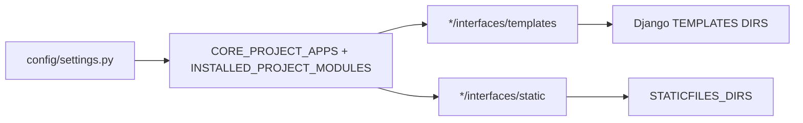

# Arquitectura modular - v1.1 hexagonal fisico estricto

> Version: v1.1
> Fecha: 2026-04-27
> Tipo: EVOLUTIVO
> App/Modulo: todos los modulos declarados en `config/modules.py`

---

## Descripcion

Se completa la fase de maxima literalidad fisica del monolito modular. Los entrypoints publicos top-level de adapters historicos dejan de existir como contrato final y cada superficie queda ubicada bajo la capa canonica que le corresponde.

## User Story

```
Como equipo de desarrollo quiero que todos los modulos tengan layout hexagonal fisico estricto para que el repo pueda sostener activacion, desactivacion y remocion de modulos sin fachadas legacy ni imports publicos ambiguos.
```

## Criterios de aceptacion

- [x] No quedan `views`, `forms`, `services`, `selectors`, `signals`, `api_views`, `serializers`, `templates`, `static`, `consumers`, `routing`, `urls` ni `api_urls` como entrypoints publicos top-level de modulos declarados.
- [x] `interfaces/web/` contiene URLConfs, views y forms.
- [x] `interfaces/api/` contiene URLConfs, views y serializers.
- [x] `interfaces/realtime/` contiene consumidores y routing WebSocket cuando aplica.
- [x] `infrastructure/` contiene services/selectors/signals que dependen de Django, ORM, cache, email o side effects.
- [x] Los loaders de Django buscan templates y static en `*/interfaces/templates` y `*/interfaces/static`.
- [x] Los tests de arquitectura fallan ante regressiones de entrypoints publicos top-level o imports legacy.

## Mapeo fisico

| Antes | Ahora |
| --- | --- |
| `modulo/views.py` o `modulo/views/` | `modulo/interfaces/web/views.py` o `modulo/interfaces/web/views/` |
| `modulo/forms.py` o `modulo/forms/` | `modulo/interfaces/web/forms.py` o `modulo/interfaces/web/forms/` |
| `modulo/api_views.py` o `modulo/api_views/` | `modulo/interfaces/api/views.py` o `modulo/interfaces/api/views/` |
| `modulo/serializers.py` | `modulo/interfaces/api/serializers.py` |
| `modulo/templates/` | `modulo/interfaces/templates/` |
| `modulo/static/` | `modulo/interfaces/static/` |
| `modulo/consumers.py` y `modulo/routing.py` | `modulo/interfaces/realtime/` |
| `modulo/services.py` o `modulo/services/` con Django | `modulo/infrastructure/services.py` o `modulo/infrastructure/services/` |
| `modulo/selectors.py` o `modulo/selectors/` con ORM | `modulo/infrastructure/selectors.py` o `modulo/infrastructure/selectors/` |
| `modulo/signals.py` o `modulo/signals/` | `modulo/infrastructure/signals.py` o `modulo/infrastructure/signals/` |

## Diagramas

### Estructura fisica



### Carga de templates y static



## Archivos principales

- `config/settings.py`: agrega loaders dinamicos para `interfaces/templates` e `interfaces/static`.
- `system_modules/tests/test_architecture.py`: bloquea entrypoints publicos top-level, imports legacy y tests de fachadas antiguas.
- `*/module.py`: mantiene rutas apuntando a `interfaces/`.
- `*/interfaces/`: contrato publico web, API, realtime, templates y static.
- `*/infrastructure/`: adapters con Django, ORM, signals y services/selectors con side effects.

## Decisiones tecnicas

- No se mueven `models.py`, migrations, `admin.py` ni `apps.py` para no romper labels, contenttypes, migraciones ni wiring Django.
- Si un service o selector conserva dependencia ORM/Django, queda inicialmente en `infrastructure/`; solo se sube a `application/` cuando pueda expresarse con puertos o reglas puras.
- Los shells (`portal`, `dashboard`, `configuracion`) conservan layout hexagonal fisico, pero no inventan dominio de negocio propio.

## Validacion esperada

- `py -3 manage.py test system_modules.tests.test_architecture --settings=config.settings_test`
- Suites focalizadas por grupo de modulos.
- `py -3 manage.py check --settings=config.settings_test`
- `py -3 manage.py test --settings=config.settings_test`
- Validacion Docker cuando el engine local este disponible.

