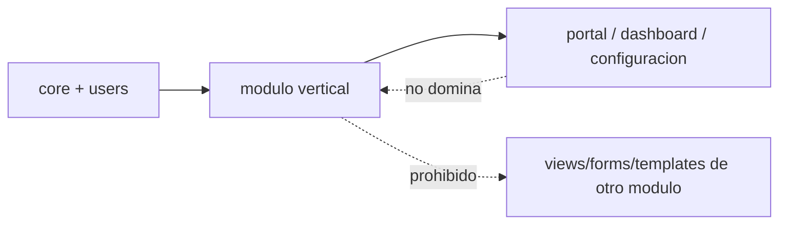

# Guia de como no romper la arquitectura

## Reglas de dependencia

## Permitido

- Consumir contratos publicos de otro modulo.
- Compartir utilidades a traves de `core` o `users`.
- Encapsular tablas historicas detras de contratos publicos cuando una migracion de datos sea riesgosa.
- Usar `system_modules` para publicar capacidades y guards.

## Prohibido

- Importar `views`, `forms` o templates de otro modulo.
- Hacer autodiscovery por filesystem para registrar modulos.
- Meter logica de negocio nueva en shells si ya existe modulo vertical.
- Agregar interfaces vacias solo por "cumplir hexagonal".
- Publicar wrappers o fachadas de compatibilidad como contrato final de un modulo migrado.

## Regla de shells

- `portal`, `dashboard` y `configuracion` solo componen capacidades.
- Todo acceso a modulo opcional debe vivir detras de un guard o una condicion de template.

## Regla de dominio

- Si el dominio tiene reglas relevantes, crear `domain/` y `application/`.
- Si solo tiene CRUD simple, alcanza con catalogo + services + guards.

## Regla de migracion

- Mover primero contratos y services.
- Mover despues templates/views.
- Mover modelos o tablas al final, con una justificacion concreta.
