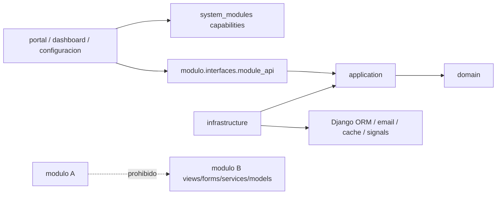

# Guia de como no romper la arquitectura

## Reglas de dependencia

## Permitido

- Consumir contratos publicos de otro modulo.
- Compartir utilidades a traves de `core` o `users`.
- Encapsular tablas historicas detras de contratos publicos cuando una migracion de datos sea riesgosa.
- Usar `system_modules` para publicar capacidades y guards.
- Mantener `models.py` top-level solo como adapter ORM requerido por Django.

## Prohibido

- Importar `views`, `forms` o templates de otro modulo.
- Importar `models`, `services`, `selectors`, `signals` o `serializers` internos de otro modulo.
- Hacer autodiscovery por filesystem para registrar modulos.
- Meter logica de negocio nueva en shells si ya existe modulo vertical.
- Publicar wrappers o fachadas de compatibilidad como contrato final de un modulo migrado.
- Publicar rutas opcionales desde `config/urls.py` por includes hardcodeados.
- Crear entrypoints publicos top-level `views`, `forms`, `services`, `selectors`, `signals`, `api_views`, `serializers`, `templates`, `static`, `consumers`, `routing`, `urls` o `api_urls` dentro de un modulo declarado.

## Regla de shells

- `portal`, `dashboard` y `configuracion` solo componen capacidades.
- Todo acceso a modulo opcional debe vivir detras de un guard o una condicion de template.

## Regla de capas

- Todo modulo declarado tiene `domain/`, `application/`, `infrastructure/` e `interfaces/`.
- `domain/` no importa Django.
- `application/` no importa Django, `models`, `views`, `forms`, `serializers`, `templates`, `consumers` ni `routing`.
- ORM, email, cache, signals y clock/transaction de Django viven en `infrastructure/`.
- Views, forms, serializers, URLConfs, templates y static viven en `interfaces/`.
- Realtime/WebSocket vive en `interfaces/realtime/`.
- Queries ORM reutilizables viven en `infrastructure/selectors/`; orquestacion con Django vive en `infrastructure/services/`; casos de uso puros o con puertos viven en `application/services.py`.
- Si una capa queda fina porque el modulo solo compone UI o health checks, el README del modulo debe decirlo.

## Regla de migracion

- Mover primero contratos publicos y URLConfs.
- Mover despues casos de uso y acceso a ORM.
- Mover views/forms/templates/static/API/realtime a `interfaces/`.
- Mover modelos o tablas al final solo si no rompe labels, migrations ni contenttypes.
